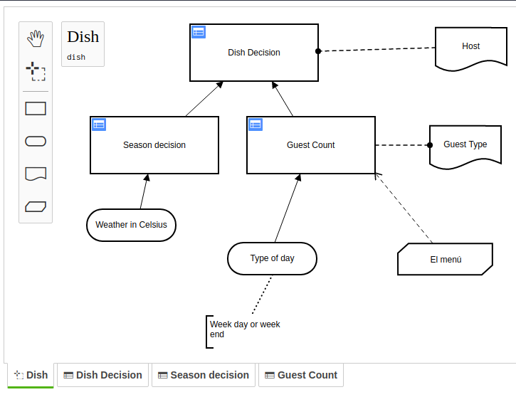

# dmn-js Modeler Example

This example showcases using the API of dmn-js to build a tabbed modeler.

It builds upon the [starter example](https://github.com/bpmn-io/dmn-js-examples/tree/master/starter).

[](https://cdn.staticaly.com/dmn-io/dmn-js-examples/master/modeler/modeler.html)

[Try it out](https://cdn.staticaly.com/gh/bpmn-io/dmn-js-examples/master/modeler/modeler.html).


## Usage Summary

Open a view using `#getViews` and `#open` when clicking on a tab.

```javascript
$('.editor-tabs').delegate('.tab', 'click', function(e) {

  // get index of view from clicked tab
  const viewIdx = parseInt(this.getAttribute('data-id'), 10);

  // get view using index
  const view = dmnModeler.getViews()[viewIdx];

  // open view
  try {
    await dmnModeler.open(view);
  } catch (err) {
    console.error('error opening tab', err);
  }
});
```

Update tabs whenever the views change.

```javascript
dmnModeler.on('views.changed', function(event) {

  // get views from event
  const { views, activeView } = event;

  // clear tabs
  $tabs.empty();

  // create a new tab for each view
  views.forEach(function(v, idx) {

    const className = CLASS_NAMES[v.type];

    const tab = $(`
      <div class="tab ${ v === activeView ? 'active' : ''}" data-id="${idx}">
        <span class="${ className }"></span>
        ${v.element.name || v.element.id}
      </div>
    `);

    $tabs.append(tab);
  });
});
```

## Licence

MIT
