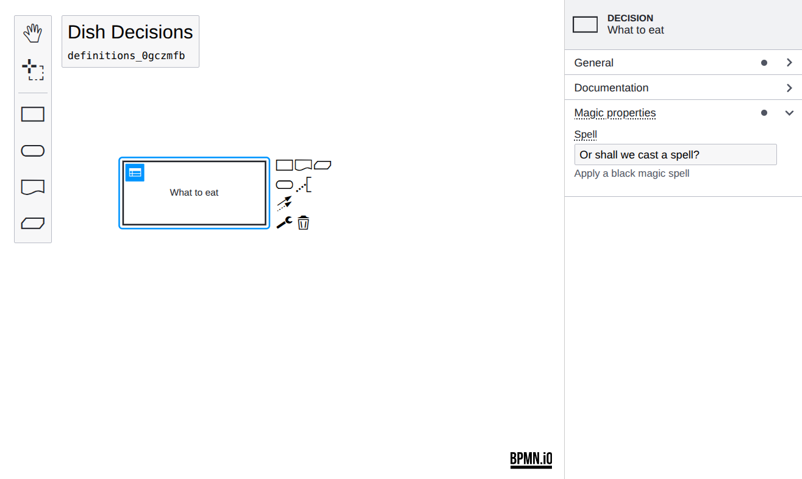

# Properties Panel Extension Example

This example shows how to extend the [dmn-js-properties-panel](https://github.com/bpmn-io/dmn-js-properties-panel) with custom properties.




## About

> If you need more information about setting up take look at the [basic properties example](../properties-panel) first.

In this example we extend the properties panel to allow editing a `magic:spell` property on all decisions. To achieve that we will walk through the following steps:

* Add a group called "Magic properties" to contain the property
* Add a "spell" text input field to this group
* Create a new moddle extension

The property `magic:spell` will be persisted as an extension as part of a DMN decision:

```xml
<?xml version="1.0" encoding="UTF-8"?>
<definitions xmlns="https://www.omg.org/spec/DMN/20191111/MODEL/" xmlns:dmndi="https://www.omg.org/spec/DMN/20191111/DMNDI/" xmlns:dc="http://www.omg.org/spec/DMN/20180521/DC/" xmlns:magic="http://magic"...>

  <decision id="decision" name="Decision" magic:spell="My Spell">
    ...
  </decision>
</definitions>
```

Let us look into all the necessary steps in detail.


### Create a Properties Provider

The first step to a custom property is to create your own `PropertiesProvider`.
The provider defines which properties are available and how they are organized in the panel using tabs, groups and input elements.

We created the [`MagicPropertiesProvider`](src/provider/magic/MagicPropertiesProvider.js) which exposes the "magic" group along with existing DMN properties. Note that we make sure that the group is shown only if a decision is selected.

```javascript
function MagicPropertiesProvider(propertiesPanel, translate) {

  // Register our custom magic properties provider.
  // Use a lower priority to ensure it is loaded after the basic BPMN properties.
  propertiesPanel.registerProvider(LOW_PRIORITY, this);

  ...

  this.getGroups = function(element) {

    ...

    return function(groups) {

      // Add the "magic" group
      if(is(element, 'dmn:Decision')) {
        groups.push(createMagicGroup(element, translate));
      }

      return groups;
    }
  };
}
```


### Define a Group

As part of the properties provider we define the magic group:

```javascript
// Import your custom property entries.
// The entry is a text input field with logic attached to create,
// update and delete the "spell" property.
import spellProps from './parts/SpellProps';

// Create the custom magic group
function createMagicGroup(element, translate) {

  // create a group called "Magic properties".
  const magicGroup = {
    id: 'magic',
    label: translate('Magic properties'),
    entries: spellProps(element),
    tooltip: translate('Make sure you know what you are doing!')
  };

  return magicGroup
}
```


### Define an Entry

The "spell" entry is defined in [`SpellProps`](src/provider/magic/parts/SpellProps.js). We reuse [`TextFieldEntry`](https://github.com/bpmn-io/properties-panel/blob/main/src/components/entries/TextField.js) to create a text field for the property. The `component` needs to be a Preact component. We use [`htm`](https://github.com/developit/htm) to create a Preact component from a tagged template.

```javascript
import { html } from 'htm/preact';

import { TextFieldEntry, isTextFieldEntryEdited } from '@bpmn-io/properties-panel';
import { useService } from 'dmn-js-properties-panel'

export default function(element) {

  return [
    {
      id: 'spell',
      element,
      component: Spell,
      isEdited: isTextFieldEntryEdited
    }
  ];
}

function Spell(props) {
  const { element, id } = props;

  const modeling = useService('modeling');
  const translate = useService('translate');
  const debounce = useService('debounceInput');

  const getValue = () => {
    return element.businessObject.spell || '';
  }

  const setValue = value => {
    return modeling.updateProperties(element, {
      spell: value
    });
  }

  return html`<${TextFieldEntry}
    id=${ id }
    element=${ element }
    description=${ translate('Apply a black magic spell') }
    label=${ translate('Spell') }
    getValue=${ getValue }
    setValue=${ setValue }
    debounce=${ debounce }
    tooltip=${ translate('Check available spells in the spellbook.') }
  />`
}
```

You can look into the [`entries`](https://github.com/bpmn-io/properties-panel/blob/main/src/components/entries/index.js) to find many other useful reusable form input components.

### Create a Moddle Extension

The second step to create a custom property is to create a moddle extension so that moddle is aware of our new property "spell". This is important for moddle to write and read DMN XML containing custom properties. The extension is basically a json descriptor file [magic.json](src/descriptors/magic.json) containing a definition of `dmn:BewitchedDecision#spell`:

```javascript
{
  "name": "Magic",
  "prefix": "magic",
  "uri": "http://magic",
  "xml": {
    "tagAlias": "lowerCase"
  },
  "associations": [],
  "types": [
    {
      "name": "BewitchedDecision",
      "extends": [
        "dmn:Decision"
      ],
      "properties": [
        {
          "name": "spell",
          "isAttr": true,
          "type": "String"
        },
      ]
    },
  ]
}
```

In this file we define the new type `BewitchesStartEvent` which extends the type `dmn:StartEvent` and adds the "spell" property as an attribute to it.

**Please note**: It is necessary to define in the descriptor which element you want to extend. If you want the property to be valid for all dmn elements, you can extend `dmn:BaseElement`:

```javascript
...

{
  "name": "BewitchedDecision",
  "extends": [
    "dmn:BaseElement"
  ],

  ...
},
```


### Plugging Everything together

To ship our custom extension with the properties panel we have to wire both the moddle extension and the properties provider when creating the modeler.

```javascript
import DmnModeler from 'dmn-js/lib/Modeler';

import {
  DmnPropertiesPanelModule,
  DmnPropertiesProviderModule
} from 'dmn-js-properties-panel';

import magicPropertiesProviderModule from './provider/magic';
import magicModdleDescriptor from './descriptors/magic';

const dmnModeler = new DmnModeler({
  container: '#canvas',
  drd: {
    propertiesPanel: {
      parent: '#properties-panel-parent'
    },
    additionalModules: [
      DmnPropertiesPanelModule,
      DmnPropertiesProviderModule,
      magicPropertiesProviderModule
    ]
  },
  moddleExtensions: {
    magic: magicModdleDescriptor
  }
});
```


## Running the Example

Install all required dependencies:

```
npm install
```

Build and run the project

```
npm start
```


## License

MIT
