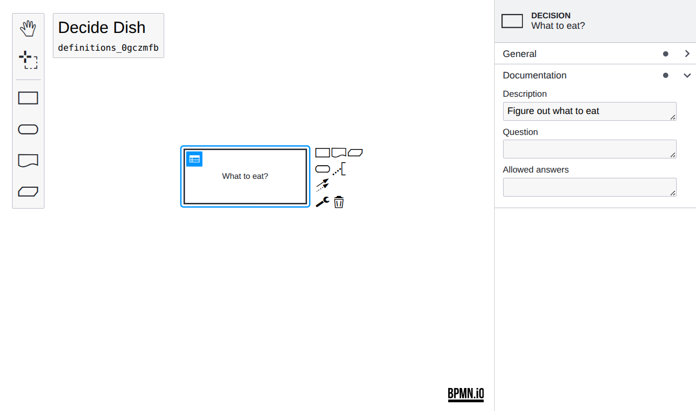

# dmn-js Modeler + Properties Panel Example

This example uses [dmn-js](https://github.com/bpmn-io/dmn-js) and [dmn-js-properties-panel](https://github.com/bpmn-io/dmn-js-properties-panel). It implements a DMN modeler that allows you to edit properties on the DRD via a properties panel.


## About

This example is a node-style web application that builds a user interface around the dmn-js DMN  modeler.



## Usage

Add the [properties panel](https://github.com/bpmn-io/dmn-js-properties-panel) together with [@bpmn-io/properties-panel](https://github.com/bpmn-io/properties-panel) to your project:

```sh
npm install --save dmn-js-properties-panel @bpmn-io/properties-panel
```

Now extend the [dmn-js](https://github.com/bpmn-io/dmn-js) modeler with two properties panel related modules, the panel itself and a provider module that controls which properties are visible for each element. Additionally you must pass an element via `propertiesPanel.parent` into which the properties panel will be rendered (cf. [`src/app.js`](https://github.com/bpmn-io/dmn-js-examples/blob/main/properties-panel/src/app.js#L16) for details).

```javascript
import { 
  DmnPropertiesPanelModule,
  DmnPropertiesProviderModule
} from 'dmn-js-properties-panel';

var dmnModeler = new DmnModeler({
  container: '#js-canvas',
  drd: {
    propertiesPanel: {
      parent: '#js-properties-panel'
    },
    additionalModules: [
      DmnPropertiesPanelModule,
      DmnPropertiesProviderModule
    ]
  }
});
```

## Building the Example

You need a [NodeJS](http://nodejs.org) development stack with [npm](https://npmjs.org) and installed to build the project.

To install all project dependencies execute

```sh
npm install
```

Build the example using [webpack](https://webpack.js.org/) via

```sh
npm run all
```

You may also spawn a development setup by executing

```sh
npm start
```